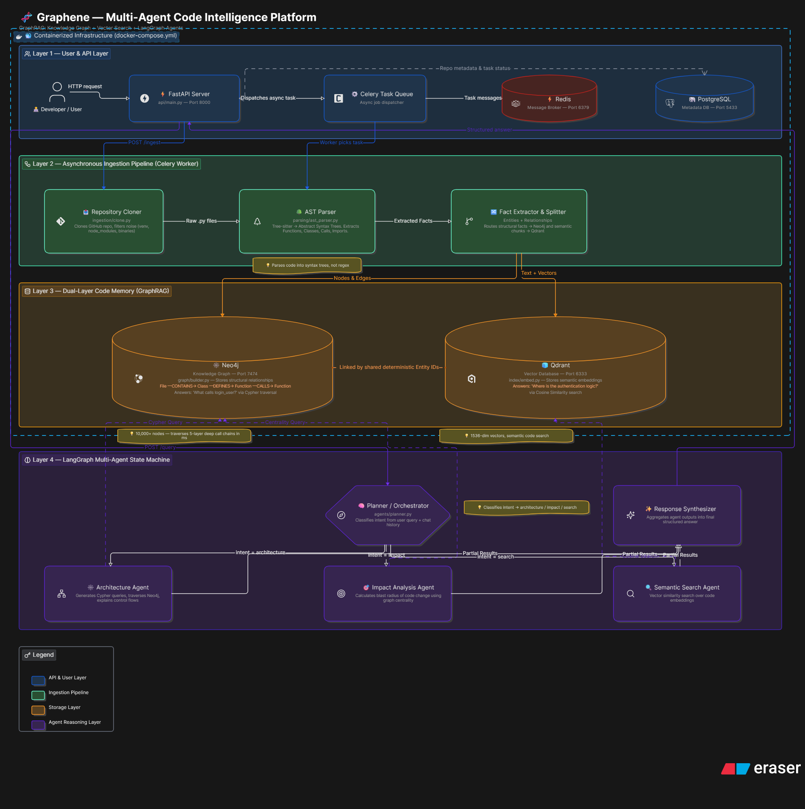

# Graphene — Multi-Agent Code Intelligence Platform

An intelligent, multi-agent AI code assistant designed to provide deep structural understanding, ripple effect analysis, and architectural insights into complex codebases.

Built to solve real-world engineering queries by combining the precise structural representation of a Knowledge Graph with the semantic search capabilities of a Vector Database.

## 🎬 Demo Videos

> **📂 [Watch the Demo Videos →](https://drive.google.com/drive/folders/1ucf4Rwjuk0fuZFop4yZNla4hzxAE67ub?usp=sharing)**

| Video | Description |
|-------|-------------|
| **GRAPHENE CODEBASE AND DOCUMENTATION REVIEW** | A complete walkthrough of the project — what Graphene is, the architecture behind it, how the multi-agent pipeline works, and a full codebase review covering every module and design decision. |
| **GRAPHENE STRESS TESTING** | A live stress-testing session pushing Graphene to its limits — testing complex queries, edge cases, large repositories, and validating the accuracy of architecture analysis, impact detection, and dead code elimination in real-time. |

## 🎯 Project Goal
The primary objective of this project is to build an agentic AI system capable of handling three distinct categories of engineering queries:

1. **Architecture Queries**: Explaining how specific flows work by traversing exact function call chains across multiple files.
2. **Impact Analysis (Ripple Effects)**: Identifying exactly which endpoints or downstream functions will break if a specific component is modified.
3. **Dead Code Elimination**: Finding functions and classes that exist but have no incoming references in the codebase.

The system relies on an ingestion pipeline that parses Abstract Syntax Trees (ASTs) rather than naive regex, ensuring absolute accuracy when querying code relationships.

## 🏗️ System Architecture & High-Level Design

<p align="center">
  
</p>

Graphene relies on a Multi-Agent Architecture built with LangGraph and FastAPI. Instead of relying on a single context-limited prompt, it intelligently orchestrates sub-agents:

* **Planner Orchestrator**: Analyzes the developer's question and routes the query to the correct specialist agent based on the intent.
* **Knowledge Graph Builder**: Uses Neo4j to store structural relationships (e.g., `Function A -[:CALLS]-> Function B`).
* **Semantic Embeddings**: Uses Qdrant vector database to perform dense retrieval when the user asks conceptual questions where exact keyword matching fails.
* **Specialist Agents**:
    * *Architecture Agent*: Traverses Neo4j to explain control flows.
    * *Impact Agent*: Calculates blast radius using graph centrality algorithms.
    * *Dead Code Agent*: Finds orphaned nodes in the graph.

### Bonus Features Implemented
* ✅ **Dockerized Infrastructure**: A highly reproducible local environment spinning up Neo4j, Qdrant, Redis, and Postgres using Docker Compose.
* ✅ **AST-Based Parsing**: Uses Tree-sitter to parse Python code into an Abstract Syntax Tree, guaranteeing 100% accurate relationship extraction compared to traditional regex methods.
* ✅ **Asynchronous Workers**: Uses Celery and Redis to handle heavy repository cloning and indexing tasks in the background without blocking the API.

## 💻 Tech Stack
**Core Pipeline & Agents**
* **Framework**: Python, FastAPI, LangGraph, LangChain
* **LLMs**: OpenAI (or open-source alternatives) for agent reasoning
* **Parsing**: Tree-sitter (Python AST bindings)
* **Asynchronous Tasks**: Celery, Redis
* **Databases**: 
    * Neo4j (Knowledge Graph for Structure)
    * Qdrant (Vector DB for Semantic Search)
    * PostgreSQL (Metadata)

**Infrastructure**
* Docker & Docker Compose

## 📂 Codebase & Folder Structure
The repository is highly organized for code clarity, making it easy for any engineer to pick up and scale.

```text
graphene/
├── api/                      # FastAPI Backend
│   └── main.py               # API entry point and routes
├── agents/                   # LangGraph Agent Nodes
│   ├── planner.py            # Intent classification and state machine
│   └── specialists.py        # Architecture, Impact, and Dead Code agents
├── graph/                    # Knowledge Graph logic
│   └── builder.py            # Neo4j insertion and relationship mapping
├── index/                    # Vector Database logic
│   └── embed.py              # Qdrant embedding ingestion
├── ingestion/                # Data collection
│   └── clone.py              # Git repository cloning and filtering
├── parsing/                  # Code analysis
│   └── ast_parser.py         # Tree-sitter AST extraction
├── workers/                  # Background task queue
│   └── tasks.py              # Celery tasks for async pipeline execution
├── docker-compose.yml        # Local infrastructure definition
├── requirements.txt          # Python dependencies
├── test_pipeline.py          # End-to-end execution script
└── README.md                 # You are here
```

## 🚀 Setup Instructions

### 1. Prerequisites
* Python 3.10+
* Docker Desktop installed and running
* Git

### 2. Infrastructure Setup
Start the local databases (Neo4j, Qdrant, Redis, Postgres):
```bash
docker-compose up -d
```

### 3. Backend Setup
Create and activate a virtual environment:
```bash
# Windows
python -m venv venv
.\venv\Scripts\activate

# Mac/Linux
python3 -m venv venv
source venv/bin/activate
```

Install dependencies:
```bash
pip install -r requirements.txt
```

### 4. Run the Pipeline
To test the full end-to-end ingestion pipeline (Cloning → AST Parsing → Neo4j → Qdrant):
```bash
python test_pipeline.py
```

### 5. Start the API Server (Optional)
```bash
uvicorn api.main:app --reload
```
The FastAPI backend will start on http://localhost:8000.

## 🌍 Deployment
Graphene's architecture is designed for easy deployment to the cloud:
* **Infrastructure**: Deploy the Docker Compose stack to an AWS EC2 instance, or migrate to managed services (e.g., Neo4j Aura, Qdrant Cloud).
* **API Backend**: Deploy the FastAPI server using Render, Railway, or AWS App Runner.
* **Workers**: Run Celery workers on dedicated instances connected to a managed Redis cluster.

---
© Copyright 2026. Made with love by Shivang Sharma.
